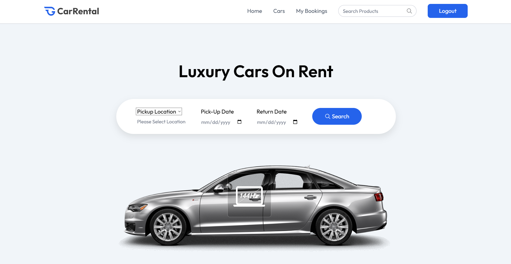
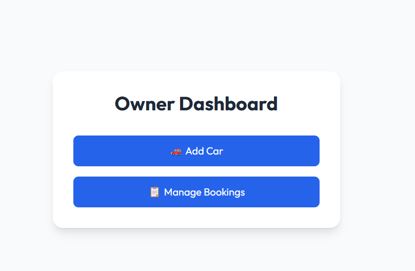

🚗 Car Rental - Full Stack MERN Application

A complete Car Rental platform where users can browse cars, book rentals, and make payments. Includes Owner Dashboard, User Authentication (Email/Password & Google Login), Razorpay Integration, and more.

🌐 Live Demo

Frontend: https://carrental-ecommerce.vercel.app

Backend API: Deployed via Render

⚙️ Tech Stack

| Tech              | Description                          |
| ----------------- | ------------------------------------ |
| **Frontend**      | React.js, Tailwind CSS, React Router |
| **Backend**       | Node.js, Express.js                  |
| **Database**      | MongoDB Atlas                        |
| **Auth**          | Firebase (Email/Password & Google)   |
| **Payments**      | Razorpay Integration                 |
| **Cloud Storage** | ImageKit for optimized car images    |

✨ Features

✔️ User Registration & Login (Email/Password + Google OAuth)

✔️ Secure JWT-based session management

✔️ Explore available cars by brand, category, or type

✔️ Car Owners can add, manage, and delete car listings

✔️ Owner Dashboard with Booking Management

✔️ Booking system with status updates (Pending → Confirmed)

✔️ Payment Gateway via Razorpay

✔️ Image optimization with ImageKit

✔️ Responsive Design for all devices

📁 Folder Structure

carrental/ 
├── backend/    // Express.js API, MongoDB models, Routes  
├── frontend/   // React.js App with Tailwind CSS  
└── .env        // Environment variables  

🚀 Getting Started (Local Setup)

1️⃣ Clone the repository

git clone https://github.com/YourUsername/carrental.git  
cd carrental
 

 2️⃣ Setup Backend

 cd backend  
npm install

Create .env inside backend:  

PORT=5000

MONGO_URL=your_mongodb_connection_string

JWT_SECRET=your_jwt_secret

Start Backend: 

npm run dev

3️⃣ Setup Frontend 

cd frontend

npm install

Create .env inside frontend:  

VITE_API_URL=http://localhost:5000

VITE_FIREBASE_API_KEY=your_firebase_key

VITE_FIREBASE_AUTH_DOMAIN=your_firebase_auth_domain

VITE_FIREBASE_PROJECT_ID=your_project_id

VITE_FIREBASE_APP_ID=your_app_id

VITE_IMAGEKIT_PUBLIC_KEY=your_imagekit_public_key

VITE_IMAGEKIT_URL_ENDPOINT=your_imagekit_url

VITE_RAZORPAY_KEY=your_razorpay_key

Start Frontend:  
npm run dev

📝 Environment Variables Reference 

You need the following keys:
 
 
| Key                    | Usage                    |
| ---------------------- | ------------------------ |
| `MONGO_URL`            | MongoDB Atlas connection |
| `JWT_SECRET`           | JWT Signing Secret       |
| `VITE_API_URL`         | Backend API URL          |
| `Firebase Credentials` | Authentication setup     |
| `ImageKit Keys`        | Car Image optimization   |
| `VITE_RAZORPAY_KEY`    | Payment Gateway          |

📸 Screenshots
 
 

| Home Page                     | Owner Dashboard                         | 
| ----------------------------- | --------------------------------------- |
|  |  |

📦 Future Improvements

* Role-based Admin panel

* Booking history for users

* Review & Rating system for cars

* Advanced car filtering options

* Email notifications for bookings

🙌 Contributing

Pull requests are welcome! For major changes, please open an issue first to discuss.

⭐ Acknowledgements

React.js

Node.js

MongoDB

Firebase

Razorpay

ImageKit

📬 Contact

Harish K

🔗 [LinkedIn](https://www.linkedin.com/in/harish-k-121735250/)  

💻 [GitHub](https://github.com/Harish-Kuppusamy)  

📧 [Email](mailto:ksharishcs20@gmail.com)  

